# VScode GitHub Coding Practice
<p align="justify">In the field of robotics, collaboration is inevitable. Therefore, we  <b>DICTATE</b> everyone to follow this tutorial to setup your coding environment. If you are just fiddling with your own code, we don't care; but if you want to team-up with others, <b>DO IT OR WE SMACK YOUR ASS</b>.

We have tried our best to stupidify it, it should be straight forward. So please, if y'all are coding altogether, please use this system, it will save you a lot of pain. If you still insist to use <I>ONEDRIVE</I>, then fine, go kiss Bill Gate's pretty rich ass.</p>

## VScode
1. **Download**
   
   Please bear in mind that VScode is just an IDE, i.e., and environment for you to code.
   Go to https://code.visualstudio.com/download to download VScode.
   We assume, you have downloaded coding environment prior to this already.
2. **Preset**
   
   Fire it up. Download some extensions. The basics for our lab are:
   - C/C++
   - C/C++ Extension Pack
   - python
   - ROS
  
      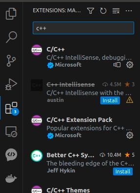 
      
      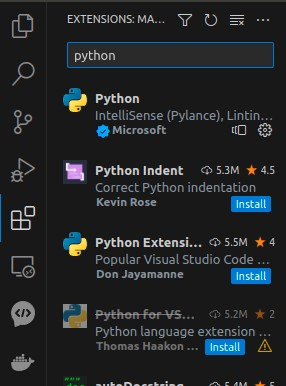

3. **Setup**
   
   Below take repo [E2ES](https://github.com/HKPolyU-UAV/E2ES) as example. After git-cloning it, in VScode >> select "Open Folder" >> select the cloned "E2ES" >> OPEN.
   
   
      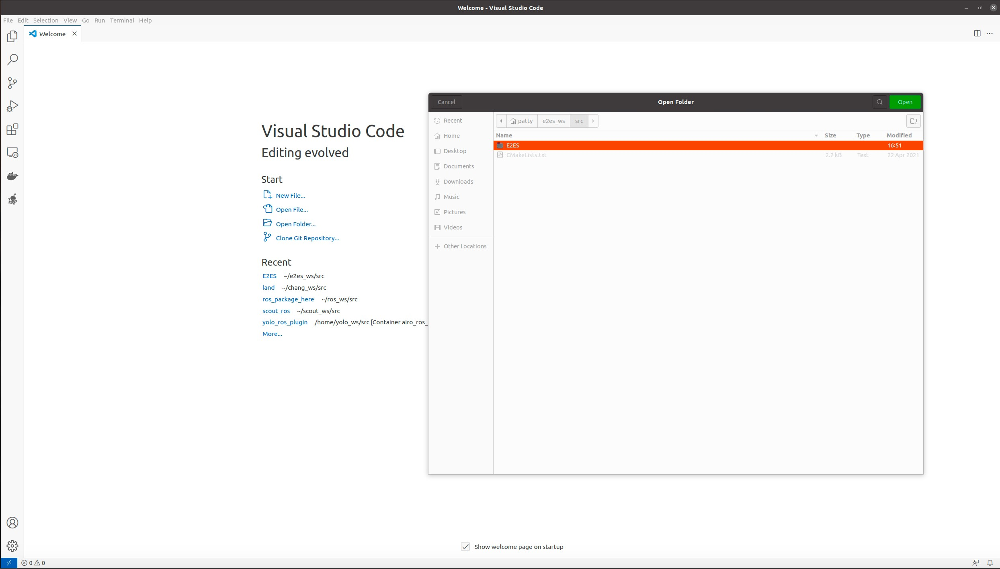

4. **.vscode**
   
   
   If all the setup are right, you should be able to see the following:
    ".vscode" config. *Note that the suggested practice is to launch VScode at the same folder of ".git"; hence ".vscode" and ".git" should be within the same directory. For GitHub setup, please refer to next session.* The ".vscode" allows us to have the basic code editing features such as code completion, parameter info, quick info, member lists and so forth. There are actually more functionalities such as debugging for you to explore; yet, personally, I am not a big fan of those. The code assistant should have sufficed in general. 
        
    

5. **Compilation**
   For compilation, As mentioned, I tried the ROS plugin in VScode, yet not a hugest fan of it. Instead, I just launch a terminal and to ```catkin_make```, I think its faster and more effieient.

## Github
   It is deemed that using GitHub with VScode is one of the most convenient practice during coding process, as we don't have to repeatedly type in git commandline to pull, commit, create branch/tag and others. Below shows the setup procedure.

1. **Config**: Of course we assume that you have all done ```sudo apt install git``` beforehand. In your terminal enter the following:
      ```
      git config --global user.name "USER_NAME"
      git config --global user.email "USER_EMAIL"
      ```
      Note that you only do this once for your computer.
2. **Initialization**: Click on source control >> "Initialize Repository" >> click on "+" & do "first commit" >> click on "commit" >> click "Publish Branch" >> enter your remote repo name >> click on it.
     
     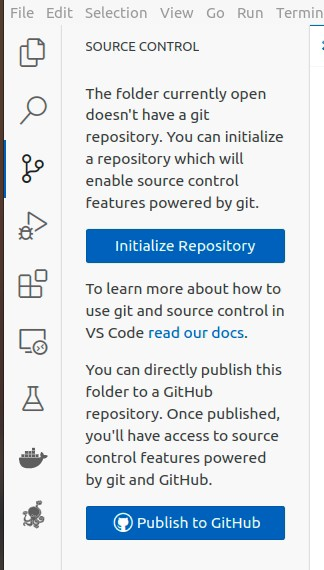
     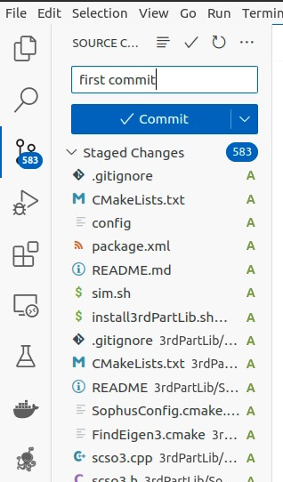
     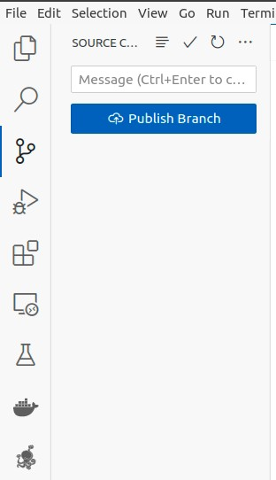
     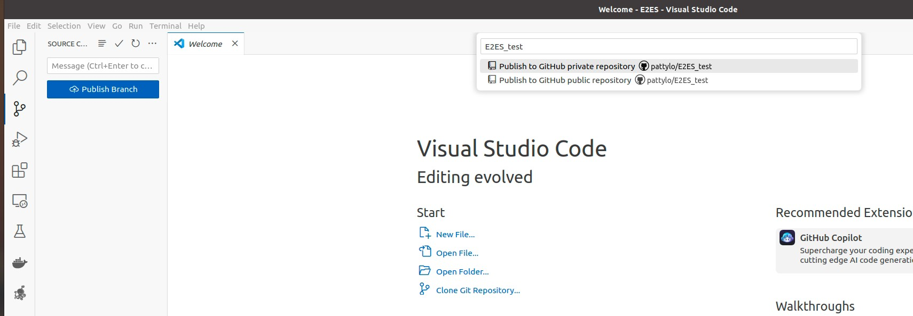
3. **Check**: Go to your GitHub page and check. Should be there. In addition, open up terminal in VScode and do ```la```, you should be able to see a folder named ".git".
     
     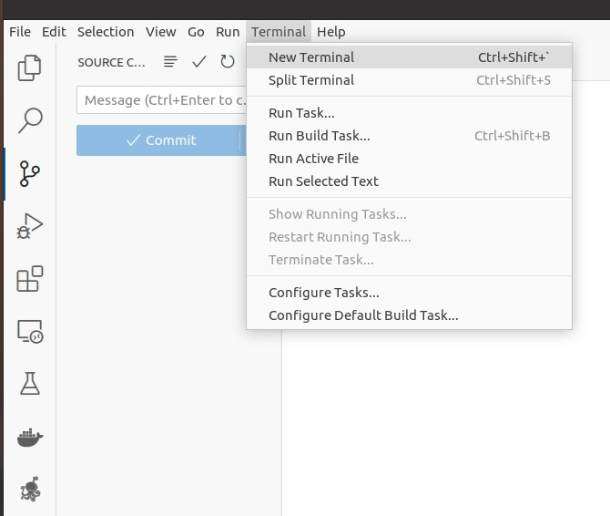
     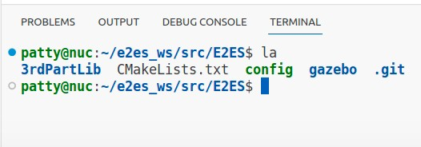
     
     This folder basically defines everything concerning git.
   
4. **Iteration**: If you are the owner of the cloned-repo, you do not need the above procedure to start coding with GitHub. After you do some modification, on source control, it will show what you have created, deleted and modified, like this:
     
     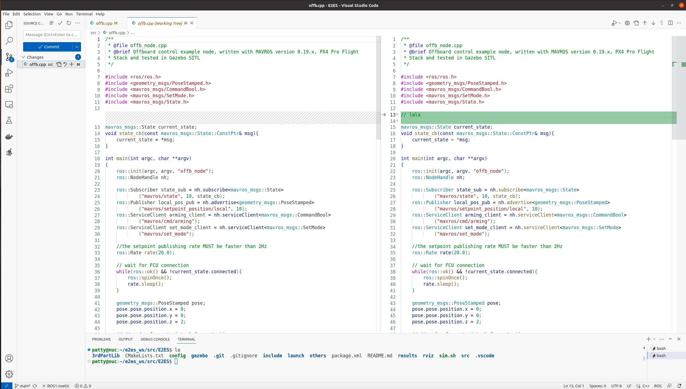

     Then, click "+" >> enter commit message >> then commit lah!

     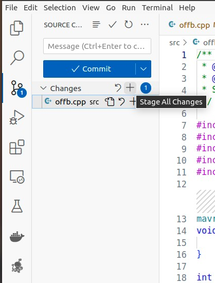

5. **Pull & Tag/Branch**: GitHub possesses a few functions people to collaborate. Most of them are source control:
     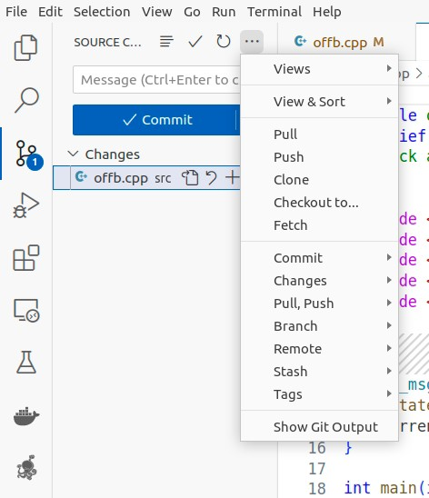

     if you just want to create branch/tag, those can also be found under the branch button.

     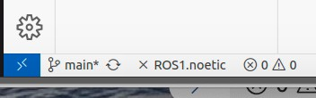
     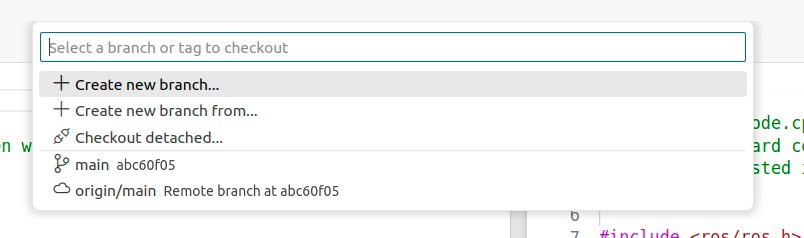

     As for the details, we'll just leave you to the Internet. Should not be that complicated.

## Remote SSH
One of the best feature of VScode, as far as we are concerned, is remote ssh. This function basically allows you to code remotely anywhere, with the right ssh configuration.

1. **Download**
   
   Download SSH extension (remember to do ```sudo apt install ssh``` on your machine first):

   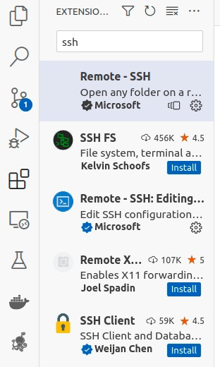

2. click on "Remote Explorer", and under "SSH" click on "+":
   
   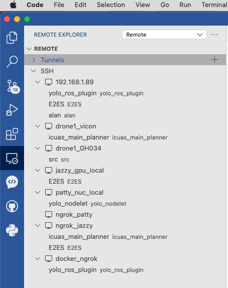

3. Type in ssh command
   
   ```
   ssh {username}@{IP_ADDRESS}
   ```
   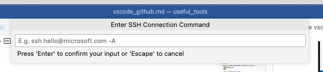

   If you are using ngrok or docker, the commandlines are pretty much the same. Below shows an example; basically, I tried to ssh to 4 ssh server, which are either on local machine/through publich domain, or on host/container.
   
   ```
   ssh patty@192.168.1.89 -p 22           # from macbook to local machine
   ssh root@192.168.1.89 -p 6666          # from macbook to local container
   ssh patty@0.tcp.jp.ngrok.io -p 12857   # from macbook thru public domain to machine
   ssh root@0.tcp.jp.ngrok.io -p 17532    # from macbook thru public domain to container
   ```

   
   Note that [ngrok](https://github.com/HKPolyU-UAV/useful_tools/blob/main/remote/Remote.md) or [docker](https://github.com/HKPolyU-UAV/docker_practice) are some practices introduced in our lab. You could visit those repo and give it a read.
4. The results should be something like this. You can now start to code just as the code is on your machine. You will be able to modify code, interact with terminal. Note that the screenshot was me connecting my ubuntu from my macbook.
   
   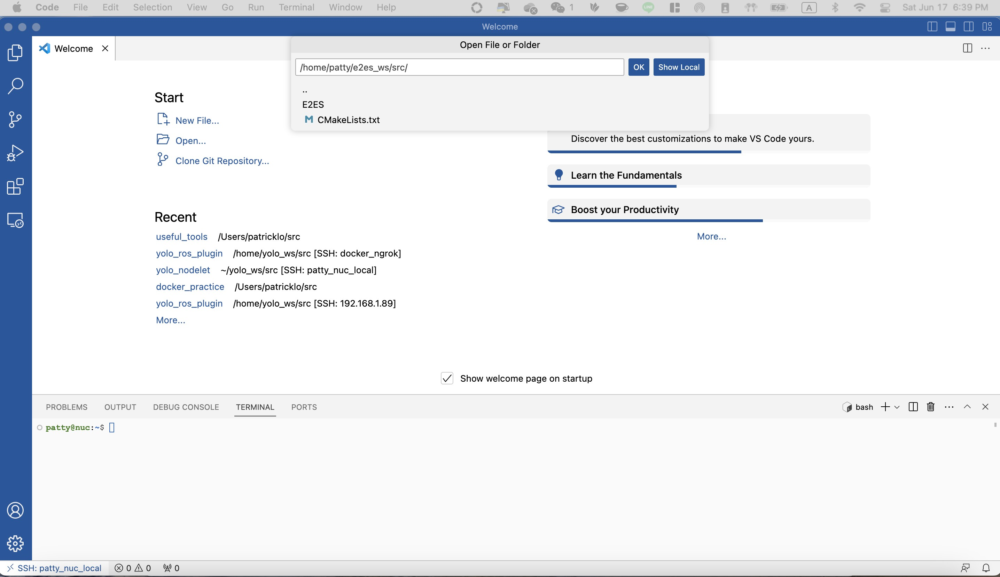

## Sidenote
Please do note that a few details were ommited, please do let us know if updates are required. In addition, there're thousands of IDEs and pracices to use GitHub, the presented here might not be optimal, but it works like a charm. If you are not very experienced, please follow this. Au Contraire, if you are familiar with the whole stuff, and could co-edit a repo smoothly, then please do stick with your own method. Hope this help.

## Maintainer
[pattylo](https://github.com/pattylo) @ AIRO-LAB @ RCUAS, HKPolyU


  